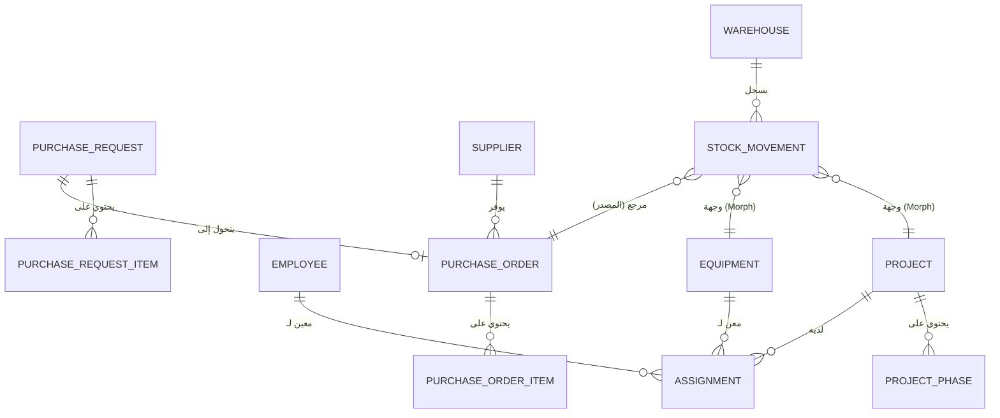

# 06. تصميم علاقات الكيانات (ERD Design)

## تصور Mermaid ERD

## تفاصيل العلاقات
1. **التعيينات (Assignments)**: جدول جسر يتعامل مع كل من الموظفين والمعدات باستخدام علاقات Laravel Polymorphic. هذا يحافظ على نظافة نموذج المشروع ويسمح بتتبع موحد لموارد الموقع.
2. **حركات المخزون (Stock Movements)**: "الوجهة" متعددة الأشكال. هذا أمر بالغ الأهمية لأن الديزل يمكن صرفه لـ "شاحنة" (معدة) أو "مشروع" (موقع عام) أو "صيانة" (داخلي).
3. **التسلسل الهرمي**: المشاريع -> المراحل -> المهام (المهام تضاف في المرحلة الثانية).
