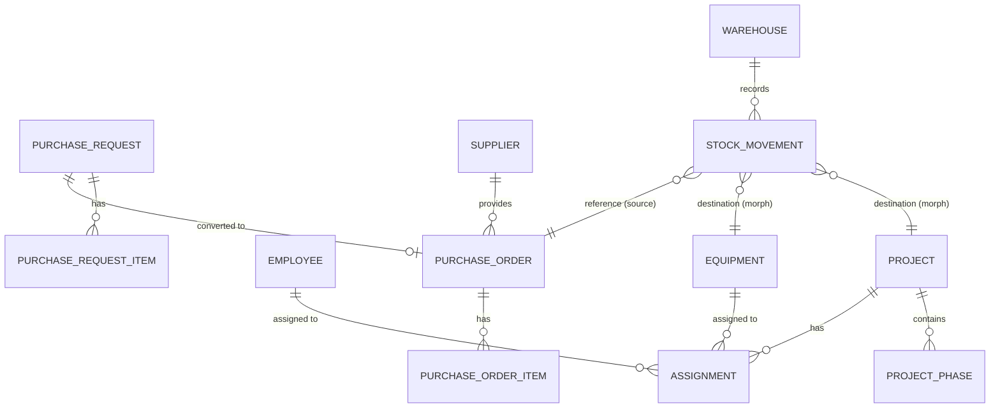

# 06. ERD Design

## Mermaid ERD Visualization

## Relationship Details
1. **Assignments**: A bridge table that handles both Employees and Equipment using Laravel's Polymorphic relationships. This keeps the Project model clean and allows unified tracking of site resources.
2. **Stock Movements**: The "Destination" is polymorphic. This is crucial because diesel can be issued to a "Truck" (Equipment) OR a "Project" (Site General) OR "Maintenance" (Internal).
3. **Hierarchy**: Projects -> Phases -> Tasks (Tasks to be added in Phase 2).
