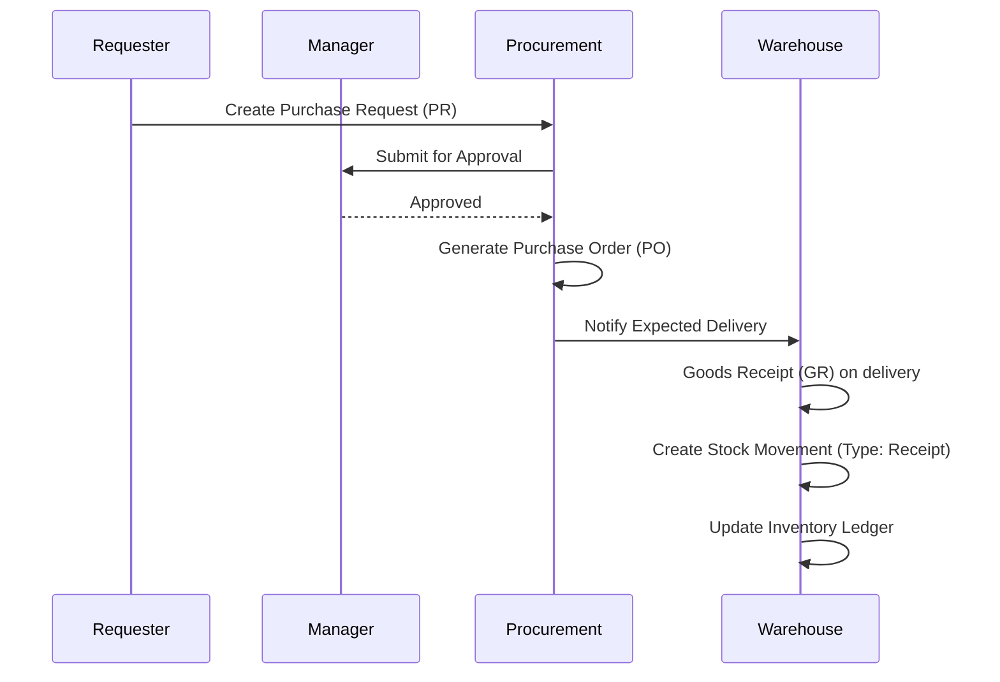

# 22. Business Flows

## Purchase-to-Stock Flow

## Inventory-to-Project Flow
1. **Request**: Project Site Supervisor requests 100 bags of cement.
2. **Verification**: Warehouse Keeper checks stock availability.
3. **Dispatch**: Warehouse issues stock.
4. **Tracking**: System creates `StockMovement` (Type: Issue, Destination: Project ID).
5. **Ledger**: Current stock is reduced.
