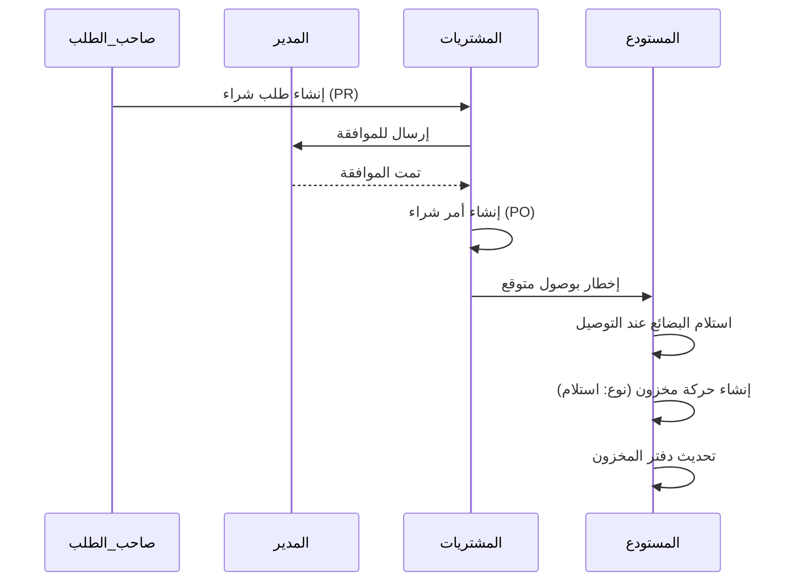

# 22. تدفقات العمل (Business Flows)

## تدفق الشراء إلى المخزون

## تدفق المخزون إلى المشروع
1. **الطلب**: يطلب مشرف الموقع 100 كيس أسمنت.
2. **التحقق**: يتحقق أمين المستودع من توفر المخزون.
3. **الصرف**: يقوم المستودع بصرف الكمية.
4. **التتبع**: ينشئ النظام حركة مخزون (النوع: صرف، الوجهة: معرف المشروع).
5. **الدفتر**: يتم خصم الكمية من الرصيد الحالي.
