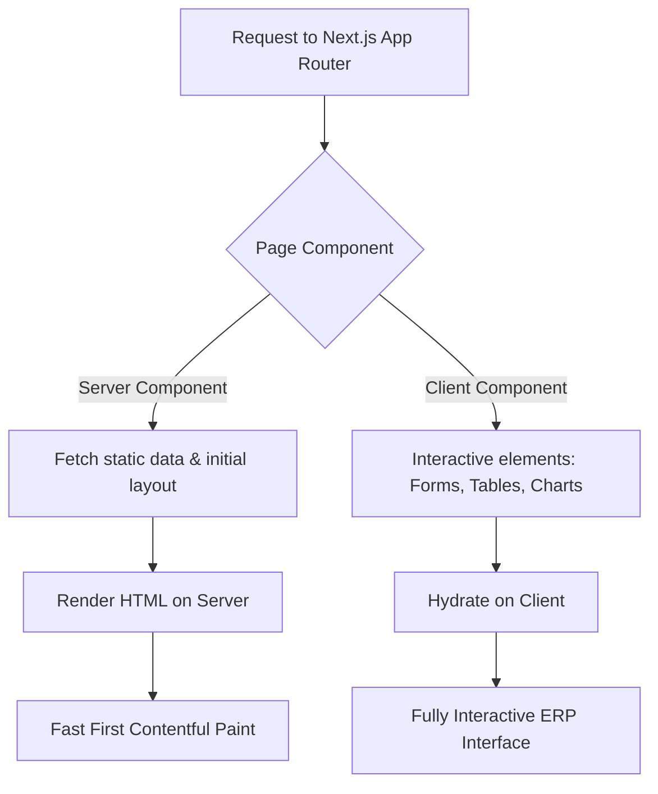

# 01. Frontend Architecture

This document defines the high-level Frontend Architecture for the **Construction ERP System**. The architecture is designed to handle heavy-duty enterprise operations, high data density, and multiple specialized modules, while maintaining excellent performance, security, and developer productivity.

---

## 1. Core Technical Stack
The system is built on a modern, type-safe, and performant frontend stack:

| Technology | Version | Purpose | Rationale |
| :--- | :--- | :--- | :--- |
| **Next.js** | `15.x` | Core Framework | App Router, React Server Components (RSC), optimized bundling, API routes, and Server Actions. |
| **TypeScript** | `5.x` | Language | Strict type safety, self-documenting code, and compile-time error checking across complex ERP models. |
| **Tailwind CSS** | `3.4+` / `4.0` | Styling | Utility-first, responsive, lightweight CSS with custom design tokens. |
| **Shadcn UI** | Latest | Base Components | Accessible (Radix UI-based), unstyled, highly customizable component primitives. |
| **TanStack Table** | `v8` | Data Grids | Headless table logic for sorting, filtering, pagination, and heavy-duty data grid manipulations. |
| **TanStack Query** | `v5` | Server State | Async state synchronization, caching, polling, prefetching, and optimistic updates. |
| **React Hook Form**| `7.x` | Form Management | Performant, uncontrolled inputs with validation integration. |
| **Zod** | `3.x` | Schema Validation | Declarative schema validation matching backend Laravel API validation rules. |
| **Framer Motion** | `11.x` | Animations | Fluid layout animations, smooth transitions, and feedback micro-interactions. |
| **ApexCharts** | `3.x` | Data Visualization | Interactive, responsive dashboards and analytics reporting. |

---

## 2. Server vs. Client Components (RSC Strategy)
We leverage Next.js 15's React Server Components to minimize bundle size and maximize initial load speeds, especially for field workers on limited connections.



### Server Components (RSC) by Default
- **Layouts & Shells**: Main navigation, sidebar structures, static page frames.
- **Read-Only Detail Pages**: Static content, project overviews, logs, and report views.
- **Initial Data Fetching**: Prefetching data using server-side fetching before hydrating TanStack Query cache.

### Client Components (`"use client"`)
- **Data Tables**: Paginated, sorted, and filtered grids requiring immediate user interaction.
- **Forms**: Form wrappers, inputs, and validation triggers using React Hook Form.
- **Interactive Dashboards**: Dynamic charts (ApexCharts) with hover effects and range filters.
- **Command Palette & Dialogs**: Globally triggered overlays, drawers, and modal popups.

---

## 3. Data Fetching & Caching Strategy
We connect to a Laravel REST API. To manage state and network requests, we divide data into **Server State** and **Client State**.

### TanStack Query (React Query)
- **Centralized Query Client**: Manages all server state.
- **Automatic Caching**: Data is cached for a configurable duration (`staleTime: 5 minutes` by default, `0` for critical real-time logs like fuel dispatch).
- **Optimistic Updates**: For operations like status updates (e.g., approving a Purchase Requisition) to make the UI feel instantaneous.
- **Infinite Scrolling**: Used in log lists (e.g., Fuel Dispatch logs) to prevent paging fatigue.

### Fetching Pattern Example
```typescript
// Custom hook wrapping TanStack Query for a specific resource
export function useProjectDetails(projectId: string) {
  return useQuery({
    queryKey: ['projects', projectId],
    queryFn: () => api.get(`/projects/${projectId}`).then(res => res.data),
    staleTime: 1000 * 60 * 5, // 5 minutes stale time
  });
}
```

---

## 4. Authentication & Security Architecture
Security is critical for multi-role ERP systems managing high-value assets and equipment.

### JWT Token Management
- Tokens are stored in **Secure, HTTP-only, SameSite=Strict Cookies** to prevent Cross-Site Scripting (XSS) and Cross-Site Request Forgery (CSRF).
- The Next.js middleware inspects these cookies to protect routes before rendering any components.

### Route Protection Middleware
```typescript
// middleware.ts
import { NextResponse } from 'next/server';
import type { NextRequest } from 'next/server';

export function middleware(request: NextRequest) {
  const token = request.cookies.get('auth_token');
  const path = request.nextUrl.pathname;

  if (!token && path.startsWith('/dashboard')) {
    return NextResponse.redirect(new URL('/login', request.url));
  }
  return NextResponse.next();
}
```

### Role-Based Access Control (RBAC)
- Client-side routes are guarded by a centralized `<RoleGuard>` component.
- The UI dynamically hides menu options, buttons, and views based on the user's role array fetched during session initialization.

---

## 5. Performance Optimization
ERP systems suffer from "bloat" due to heavy tables, complex forms, and multiple graphs. We mitigate this through:
- **Route-Based Code Splitting**: Next.js automatically bundles pages separately.
- **Component Lazy Loading**: Heavy components like ApexCharts or complex item-selector dialogs are loaded dynamically:
  ```typescript
  const ApexChart = dynamic(() => import('react-apexcharts'), { ssr: false });
  ```
- **Virtualization**: Large dropdowns (e.g., choosing from 10,000 inventory items) use virtualized lists (via `react-virtual`) to render only visible elements.
- **Debounced Fetching**: Global and select search inputs use a 300ms debounce to prevent API spamming.

---

## 6. Monolithic-Multi-Module Strategy (Folder Isolation)
To prepare the system for the massive scale of Phase 2 (Payroll, HR, concrete plant, etc.), we enforce strict domain folders. 
- Each domain (e.g., `projects`, `inventory`, `purchasing`) has its own `/components`, `/hooks`, and `/types` subfolders.
- Shared components (e.g., layouts, base buttons, generic tables) live in the root `/components/ui` and `/components/shared`.
