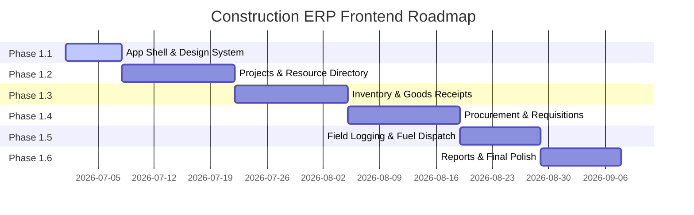

# 20. Development Roadmap

This document outlines the phased build strategy, prioritization matrix, and estimated scope of work for the **Construction ERP System Frontend**.

---

## 1. Screen Prioritization Matrix

We categorize screens using a value-effort matrix to identify quick wins and plan major milestones.

```
       [ Prioritization Matrix ]
  ┌────────────────────────────────────────────────────────┐
  │ High Impact / Low Effort    │ High Impact / High Effort │
  │ - Quick Fuel Dispatch Log  │ - Project Overview Gantt  │
  │ - Daily Attendance Sheet    │ - Dynamic Goods Receipt   │
  │ - Equipment Directory       │ - PR-to-PO Approval Board │
  ├─────────────────────────────┼───────────────────────────┤
  │ Low Impact / Low Effort     │ Low Impact / High Effort  │
  │ - Warehouse Yard Config     │ - Custom PDF Generator    │
  │ - Supplier Profile Edit     │ - Historical Chart Audits │
  └─────────────────────────────└───────────────────────────┘
```

---

## 2. Implementation Phases



### Phase 1.1: Foundations & Shell (Duration: 7 Days)
- Establish Tailwind configurations and HSL token variables (Light/Dark themes).
- Export primitive components (Shadcn Buttons, Inputs, Dialogs).
- Implement global Next.js middleware routing guards and basic JWT authentication hooks.
- Render global Sidebar layout and Command Palette.

### Phase 1.2: Projects & Resources (Duration: 14 Days)
- Build `/projects` grid page.
- Implement `/projects/[id]` multi-tab canvas and Gantt component.
- Build Employees and Equipment lists with basic filters.

### Phase 1.3: Inventory & Warehouse (Duration: 14 Days)
- Build Warehouses status dashboard.
- Develop Items catalog list view with low-stock alerts.
- Implement the Goods Receipt screen with barcode scanner dialog.
- Build Warehouse transfer form.

### Phase 1.4: Procurement & Requisitions (Duration: 14 Days)
- Build Requisitions (PR) list and multi-step creation form.
- Develop PR Approval Panel with rejection dialog.
- Build Purchase Order (PO) document preview and download page.

### Phase 1.5: Field Logging & Fuel Dispatch (Duration: 10 Days)
- Build mobile-first Fuel Dispatch entry form.
- Develop daily attendance checklist grid with offline caching hooks.
- Build Senior Recorder daily logs review panel.

### Phase 1.6: Reports, Dashboards & Polish (Duration: 10 Days)
- Connect dynamic ApexCharts.
- Integrate CSV/Excel exporters.
- Optimize component rendering (memoization, dynamic loading).
- Run cross-browser compatibility tests on tablets.

---

## 3. Work Volume Estimations

| Module | Scope / Features | Number of Screens | Estimation (Dev-Days) |
| :--- | :--- | :--- | :--- |
| **System Shell & Core** | Sidebar, Auth, Layouts, CSS | 4 | 7 |
| **Projects Module** | List, Details, Gantt, Phases | 6 | 14 |
| **Resources Directory** | Worker database, Equipment | 4 | 8 |
| **Procurement Module** | Requisitions (PR), Orders (PO) | 6 | 14 |
| **Inventory Module** | Stock catalog, Receipts, Yards | 6 | 14 |
| **Field Records Logs** | Attendance, Fuel Log | 4 | 10 |
| **Reporting & Export** | Charts, Excel/PDF exports | 4 | 10 |
| **Total Phase 1** | | **34 Screens** | **77 Dev-Days** |
